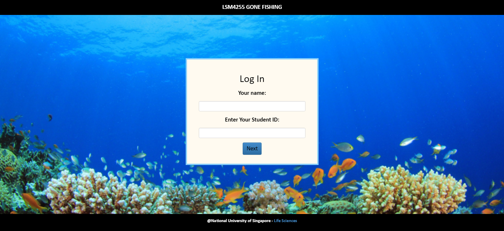
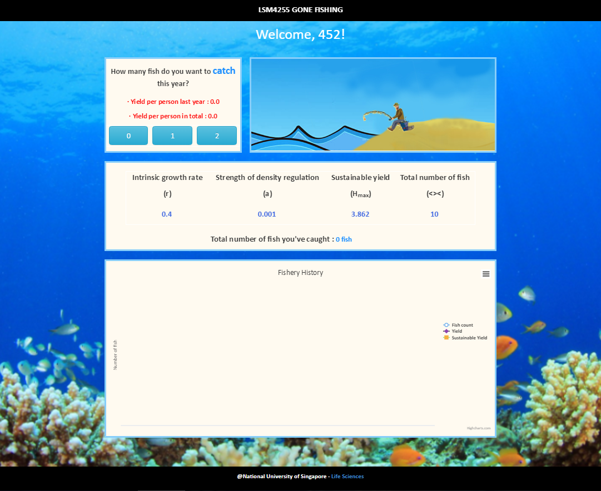
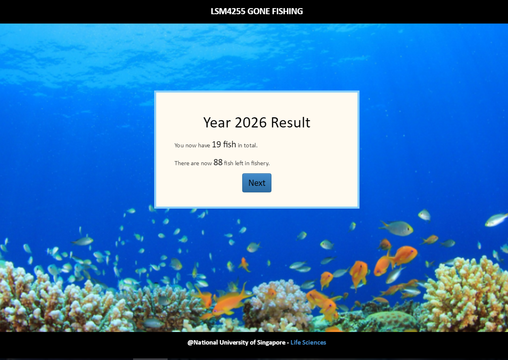
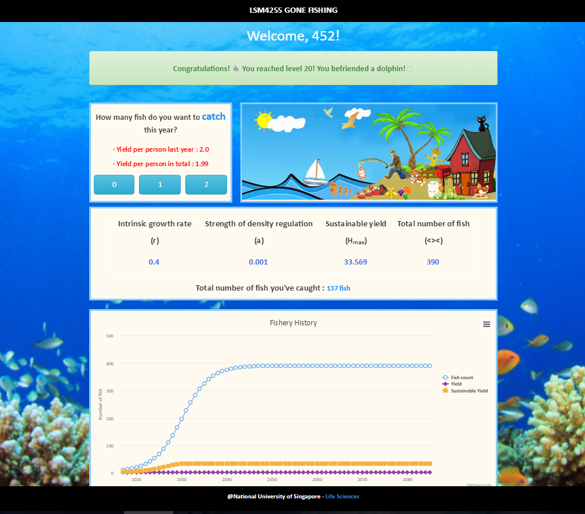

# Fishery App

__Fishery App for NUS LSM4255 (Methods in Mathematical Biology)__

* This is a CAI web application for LSM4255 course in NUS
* Allow students to participate in a fisheries management game
* Demonstrate the concepts of resource use, co-operation, and the tragedy of the commons

Heroku demo: https://fishery-app.herokuapp.com

Professor's blog:https://ryanchisholm.wordpress.com/2017/11/11/students-develop-fishery-management-game-for-teaching-the-tragedy-of-the-commons/

---

image::images/instruction.png[width="600"]

image::images/in-class demo.PNG[width="600"]

---

== For Developers
* This application is *written based on otree platform*, using Python as the programming language.
* You should go to http://otree.readthedocs.org to have a general idea of otree platform.
* To get started, go to: fishery/templates, the main files to be edited are: models.py and views.py, to edit the content of the web pages, go to fishery/templates/fishery, two main html pages are StudentCatch.html and StudentFinalResult.html, using Django as the framework.
* The server is using Heroku.

== Acknowledgements
* This application were inspired by the excellent otree platform.

